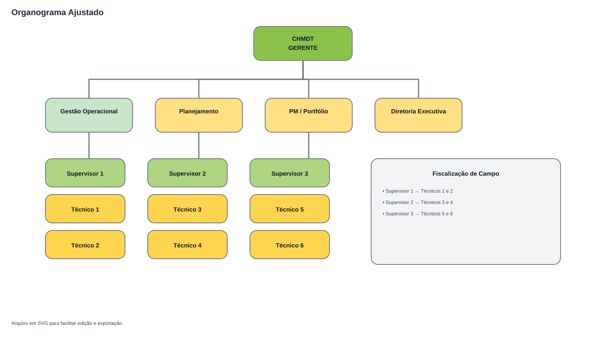
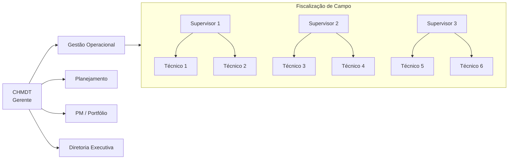

# Organograma (versão ajustável)

Você tinha razão: agora também deixei **a imagem do organograma** no repositório.

Arquivo da imagem: `docs/organograma.svg`.

## Visão geral editável (Mermaid)

## Como ajustar rapidamente

1. Para editar visualmente, abra `docs/organograma.svg` em qualquer editor SVG (Figma, Inkscape, Illustrator, etc.).
2. Para editar em texto, ajuste o bloco Mermaid acima.
3. Para exportar PNG/PDF, use o próprio editor SVG.
